<style>
code {
    height: 75%;
}    
</style>
# Exploring Concurrency in Ruby

<!--
Welcome everyone
Today i'll talk about:
- who I am
- what concurrency is broadly
- usage in a production application
- the primitives in ruby to make it happen Threads, fibers, and a bit on ractors
- Gems that can make it easier
- some lessesons learned
 -->

---

# Who Am I?

<!-- 
Introduce self

Senior dev at shopify 3 years (ruby experience)
Almost 15 years total experience, prior experience in C#, Nodejs, java, swift.  
You can find me on github @catwomey

-->


Chester Twomey
Senior Developer @ Shopify
https://github.com/catwomey

--- 

# What is concurrency?

<!-- 
- Ask the audience  the definition of concurrency

Expecting:  Concurrency is the ability for a process to manage multiple tasks, not necessarily in parallel

- Ask the audience the difference between parallism and concurrency
 
 Expecting: Parallel execution is two things occurring at the same time.  

- Ask the audience if anyone can think of examples of concurrency?
Looking for async tasks like web requests, file system reads, database calls

Parallism would be like ractors and active job or spawning multiple processes
 -->

---

<!--
concurrency 
Rough diagram of a concurrent process.
- you can see here we're flipping between the two tasks 
- This is often used for io bound tasks where you're waiting
- io bound task examples are http calls, or file system reads/writes
-->



---

<!--
Parallelism 
Rough diagram of parallel process
- Each process can carry out a task at once
- Parallel processing is often best for cpu bound tasks.  eg math calculations, compiling
- you can also have concurrency happening inside of each of these processes
-->



---

<!--
- Story time
- My team was tasked with presenting financial data from various parts of shopify in a single unified model
- problems: 
    - we didn't have the time to colocate all of the data
    - We needed to do major transformation, 
    - not all of the endpoints were performant
- solution:
    - Create a unified model of all of our financial applications
    -  reach out to all of the services.
    - mash all of the data together in a common format

Doing this sequentially means you are getting the total sum of the rpc calls eg 1 + 2+ 3 is 6 seconds
If we handle this concurrently we can cut that down to the longest call, in the example 3 seconds
 -->


---
<!-- 
For the sake of simplicity let's pretend this client code is what we use to reach out to these services
You can see here we have a few different expected latencies.  One client is really slow, one has a range of runtimes, and one is lightning fast.  This is a very loose approximation of what our challenges were
-->
```ruby
!!!include(examples/client.rb)!!!
```

---

<style scoped>
section {
    display: flex;
    justify-content: space-between;
}
</style>

### Threads


<!-- 
- Threads are the first concurrency primititive we considered
- you can create a new thread with a block 
- you can call join to pause the main thread and switch to the active one.
- Here you can see i'm putting them into an array and calling .join on each one allowing for concrrent calls into my client
- Threads are user more memory than a fiber, but less than creating a new process
- vm managed and scheduled, Scheduling is OS dependant
- Each thread is subject to the Global vm lock (GVL), or in other terms the Global Interpreter lock (GIL)
- Threads are created in blocks so variable scope is the same, variables declared in the block are only available in the block.

source https://docs.ruby-lang.org/en/3.4/Thread.html -->

```ruby
!!!include(examples/threading.rb)!!!
```

---
<style scoped>
section {
    display: flex;
    justify-content: space-between;
}
</style>
### Threads

<!-- 
point out the response order is different than the run order
the total time is not the sum of all of them
Threads are more intensive than fibers
-->
```
!!!include(examples/threading.txt)!!!
```

---
<style scoped>
section {
    display: flex;
    justify-content: space-between;
}
</style>
### Fibers

<!-- 
Presentation notes:
- Fibers are lightweight cooperative concurrency
- fibers must be specifically scheduled and controlled by the programmer
- Until ruby 3 fibers were blocking. So you had to ensure you were using non blocking processes.  eg non blocking io, sleep would stop the world, waits would stop the next step in the fiber from performing
- show the special lambda 
- They are lighter weight than threads as the programmer controls when to run them instead of the VM like with threads
- each fiber comes with a stack and you can resume from a deep nesting
- you need to call rsume to get a value from a fiber, yield/termination or transfer pass back a value

additional notes:
Fibers are primitives for implementing light weight cooperative concurrency in Ruby. Basically they are a means of creating code blocks that can be paused and resumed, much like threads. The main difference is that they are never preempted and that the scheduling must be done by the programmer and not the VM.

As opposed to other stackless light weight concurrency models, each fiber comes with a stack. This enables the fiber to be paused from deeply nested function calls within the fiber block. See the ruby(1) manpage to configure the size of the fiber stack(s).

When a fiber is created it will not run automatically. Rather it must be explicitly asked to run using the Fiber#resume method. The code running inside the fiber can give up control by calling Fiber.yield in which case it yields control back to caller (the caller of the Fiber#resume).

Upon yielding or termination the Fiber returns the value of the last executed expression

source https://docs.ruby-lang.org/en/3.4/Fiber.html

-->

```ruby
!!!include(examples/fiber_blocking.rb)!!!
```

---
<style scoped>
section {
    display: flex;
    justify-content: space-between;
}
</style>
### Fibers

<!-- 
You can see i had a similar response here, the fibers are cooperating.

With blocking fibers this only works because we aren't using blocking io, or in the case of our fake client sleep
-->

```
!!!include(examples/fiber_blocking.txt)!!!
```

---
<style scoped>
section {
    display: flex;
    justify-content: space-between;
}
</style>
### Non Blocking Fibers

<!-- 
Starting in Ruby 3.x  Fibers could be non blocking, but you must include your own scheduler.
- here i'm using the scheduler from the async gem https://github.com/socketry/async?tab=readme-ov-file, as ruby doesn't include a default scheduler for use. 
- Here i'm using a client that is doing a blocking operation without the need to yield 
- This is much closer to our thread example earlier, we can encapsulate our code  in a block and not worry about coodination
-->

```ruby
!!!include(examples/fiber_non_blocking.rb)!!!
```

---
<style scoped>
section {
    display: flex;
    justify-content: space-between;
}
</style>
### Non Blocking Fibers

<!-- 
Again you can see we start up the clients in a different order than the response time.
-->
```
!!!include(examples/fiber_non_blocking.txt)!!!
```

---
<style scoped>
section {
    display: flex;
    justify-content: space-between;
}
</style>
### Concurrent-ruby

<!-- 
Those are the primitives available for concurrency, but did we in the end we opted for a more hardened solution Concurrenct-ruby
- here's an example of promises from the concurrent-ruby library
- heavily inspired by js promises, with extensions
- The library is more than just promises, .
Modern concurrency tools including agents, futures, promises, thread pools, supervisors, and more. Inspired by Erlang, Clojure, Scala, Go, Java, JavaScript, and classic concurrency patterns.
- The library utilizes threads and has thread pools and executors to handle differing workloads
- Has immutable data structures to maintain thread saftey
-->

```ruby
!!!include(examples/concurrent_with_slow_client.rb)!!!
```

---
<style scoped>
section {
    display: flex;
    justify-content: space-between;
}
</style>
### Concurrent-ruby

```
!!!include(examples/concurrent_with_slow_client.txt)!!!
```

---
<style scoped>
section {
    display: flex;
    justify-content: space-between;
}

</style>
### Ractors

<!-- 
Until now everything we've talked about has been concurrent and subject to the GVL, global vm lock. (mri's GIL term)

Ractors are isolated from each other
Ractors require that you communicate with immutable objects (eg. frozen arrays)
Ractors are best suited to cpu intensive processes instead of io bounds ones

Ractors are still experimental, many common patterns don't work with them eg singletons 

In the future they could be a good alternative to multiple processes

source: https://docs.ruby-lang.org/en/3.4/ractor_md.html
 -->

```ruby
!!!include(examples/ractor.rb)!!!
```

---
<style scoped>
section {
    display: flex;
    justify-content: space-between;
}
</style>
### Ractors

```
!!!include(examples/ractor.txt)!!!
```

---
<style scoped>
section {
    display: flex;
    justify-content: space-around;
}
</style>    
### Lessons Learned

<!-- 
- Our logging framework was using CurrentAttributes to give rich metadata, our logs from within our promises (which are threads) weren't reading 
- When writing concurrent code you might up in a situation where you want to return partial results.
- Our slowest database query ended up being < 200ms, where is our slowest service call was somewhere in the 4 second range.
- It seems obvious but ruby is full of mutable references, you need to ensure that the data you share between threads is immutable to ensure you don't introduce unintended bugs.
 -->

- Watch out for thread scoped state in your application.  EG. [ActiveSupport CurrentAttributes](https://api.rubyonrails.org/classes/ActiveSupport/CurrentAttributes.html) 
- Database calls are often fast enough, if they aren't ActiveRecord does have a native way to handle async code.
- Concurrent calls mean you may have partial state to return.  This increases the complexity of your code
- Ruby is full of mutable references, objects you share should between threads should be immutable!


--- 


Questions?


https://github.com/catwomey/winnipegrb-exploring-ruby-concurrency